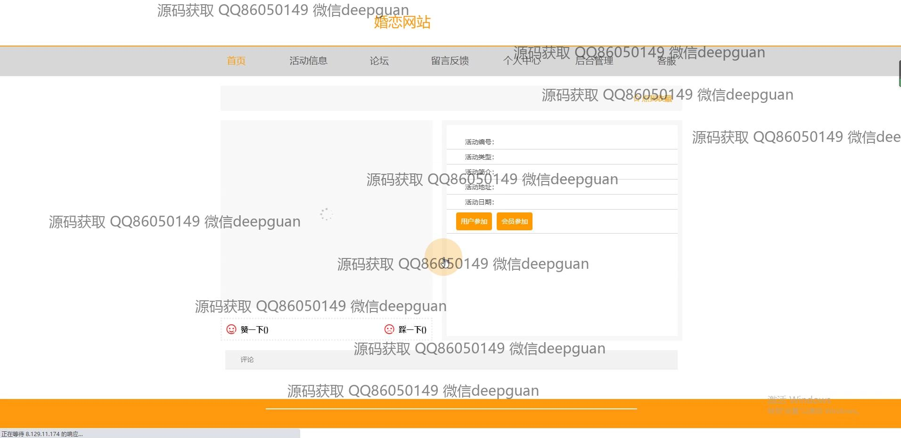

<h1 align="center">基于SSM的婚恋网站的设计与实现+vue</h1>

## 简介
A婚恋网站，角色分为管理员和用户；功能包括用户管理、会员管理、活动管理、论坛交流、留言反馈、个人中心、轮播图管理、支付及充值信息管理等模块。    --计算机毕业设计源码；毕设源码；java毕业设计源码

## 联系方式

<h3 align="center">获取完整代码与数据库文件 + 微信：deepguan QQ: 86050149 QQ群: 783742310</h3>

<h3 align="center">可帮忙远程部署 包运行成功！提供远程部署、修改代码、设计文档指导、代码讲解等服务！</h3>

## 功能介绍（完整见运行截图）
管理员：基本功能包括登录、注册和退出。管理后台提供用户管理、会员管理、活动管理、论坛管理、留言板管理、消息管理、充值信息管理和轮播图管理等模块。管理员可以在页面中心进行数据的添加、删除、审核和查询操作，支持对用户信息、活动信息和会员服务的管理。界面简洁、功能明确，提高了后台管理的效率和便捷性。

用户：拥有注册和登录功能，进入网站后可访问活动信息、论坛、留言反馈、个人中心和客户服务。用户可在论坛发布主题、参与信息管理，进行活动报名和收藏。此外，用户中心提供信息编辑、个人照片上传和评论功能。通过简洁友好的界面设计和丰富的互动功能，用户可轻松进行个人信息管理、参与活动及与其他用户交流。

## 运行截图

本代码来源于网络,仅供学习参考使用!

